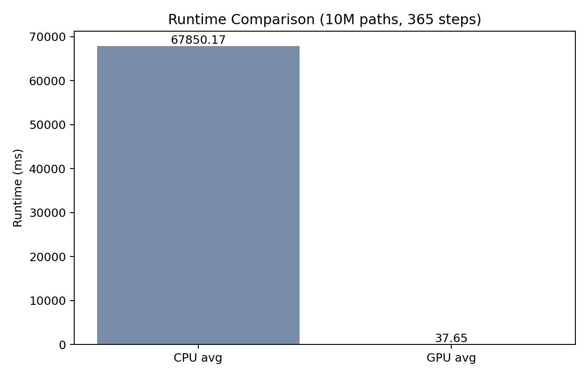
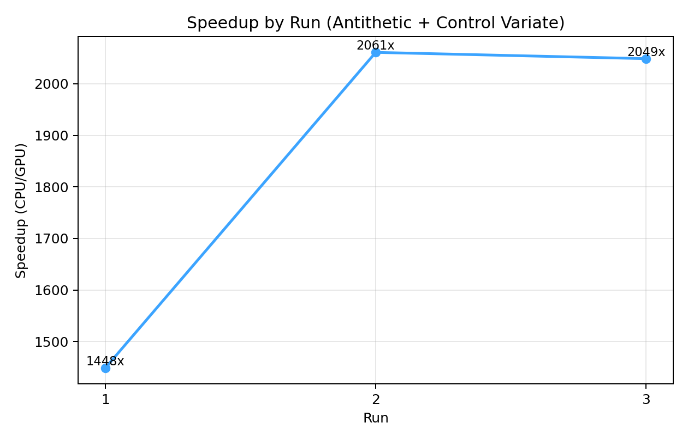
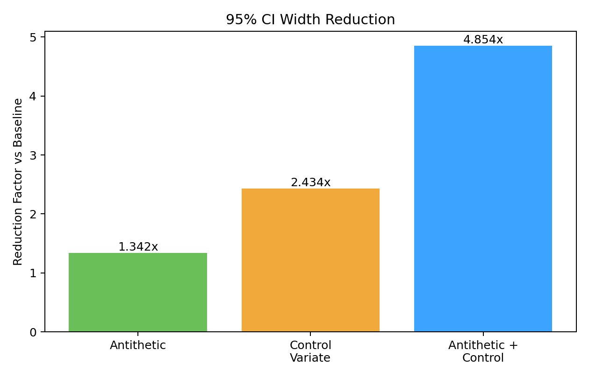
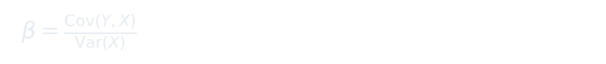

# CUDA-Accelerated Path Simulation Engine

A high-throughput Monte Carlo pricing engine with matched C++/CUDA implementations, variance reduction, Greeks estimation, convergence analysis, and performance regression gates.

## Tech Stack

C++20, CUDA, Python, CMake, Nsight Systems, Nsight Compute, Valgrind

## Features

- Native CPU (`mc_cpu`) and CUDA (`mc_gpu`) pricing engines
- On-device random generation with `curand` and vectorized normal draws (`curand_normal4`)
- Optional low-discrepancy path mode (`--rng sobol`) for quasi-Monte Carlo style sampling
- Optional mixed-precision path propagation (`--math mixed`) with FP64 accumulators
- CUDA warp-shuffle reductions, coalesced global writes, and stream-overlapped async copies
- Pricing models:
  - `european` call
  - `asian` arithmetic-average call
  - `upout` up-and-out barrier call
- Variance reduction:
  - antithetic variates (`--antithetic`)
  - control variate (`--control-variate`)
- Quant validation metrics:
  - 95% confidence intervals
  - Black-Scholes price check (European)
  - pathwise Greeks (`delta`, `vega`) with Black-Scholes references
- Engineering rigor:
  - CPU/GPU parity gate
  - stress suite (off-nominal scenarios)
  - performance regression gate with thresholds

## Visual Results

### Runtime (CPU vs GPU)



### Speedup Across Runs



### Variance-Reduction Impact



## Equations

Risk-neutral GBM dynamics:


European call payoff:


Control variate estimator:




Pathwise Greeks (European):


## Quickstart

```bash
cmake -S . -B build -DCMAKE_BUILD_TYPE=Release -DCMAKE_CUDA_ARCHITECTURES=75
cmake --build build -j

./build/mc_gpu --paths 10000000 --steps 365 --payoff european --antithetic --control-variate
./build/mc_gpu --paths 10000000 --steps 365 --payoff european --antithetic --control-variate --rng sobol
./build/mc_gpu --paths 10000000 --steps 365 --payoff european --antithetic --control-variate --math mixed
```

`--rng sobol` and `--math mixed` are implemented for the CUDA engine; the CPU binary accepts the same flags so parity and benchmarking scripts can share one CLI shape.
The `--rng sobol --math mixed` combination is intentionally disabled until the low-discrepancy + mixed-precision interaction is numerically revalidated.

## Validation Workflow

```bash
# Benchmark
python3 scripts/benchmark.py --build-dir build --paths 10000000 --steps 365 --runs 3 --payoff european --antithetic --control-variate

# CPU/GPU parity + CI overlap
python3 scripts/validate_parity.py --build-dir build --paths 2000000 --steps 365 --payoff european --antithetic --control-variate --price-tol 0.05 --require-ci-overlap

# Convergence (baseline, antithetic, control, antithetic+control)
python3 scripts/convergence_report.py --build-dir build --engine gpu --steps 365 --payoff european

# Stress scenarios
python3 scripts/stress_suite.py --build-dir build

# RNG/math mode sweep
python3 scripts/mode_sweep.py --build-dir build --paths 2000000 --steps 365 --payoff european --antithetic --control-variate

# Perf regression gate
python3 scripts/perf_gate.py --benchmark-csv results/benchmark_results.csv --convergence-csv results/convergence/gpu_convergence.csv --thresholds configs/perf_gate_thresholds.json
```

## Profiling

```bash
# Nsight Systems
bash scripts/profile_nsight.sh build 10000000 365 european

# Nsight Compute (.ncu-rep + CSV)
bash scripts/profile_ncu.sh build 10000000 365 european
bash scripts/profile_ncu_csv.sh build results/ncu_metrics_after.csv 10000000 365
```

## Output Artifacts

Generated in `results/`:

- `benchmark_results.csv`
- `runtime_comparison.png`
- `convergence/gpu_convergence.csv`
- `convergence/convergence_error.png`
- `convergence/convergence_ci_width.png`
- `modes/mode_sweep.csv`
- `ncu_profile.ncu-rep` / `ncu_metrics_*.csv` (profiling runs)

## Latest Verification Snapshot

Reference hardware: Google Colab `NVIDIA Tesla T4`, CUDA 12.8  
Reference workload: `10,000,000` paths, `365` steps, `european`, `--antithetic --control-variate`

- CPU runtime (avg, 3 runs): `67669.117 ms`
- GPU runtime (avg, 3 runs): `43.663 ms`
- Avg speedup: `1588.91x`
- CPU/GPU CV price diff (parity run): `0.001026` (`CI overlap=1`)
- CI-width reduction factors:
  - antithetic: `1.342x`
  - control variate: `2.434x`
  - antithetic+control: `4.854x`
- Stress suite: `passed`
- Mode sweep (`2,000,000` paths, `365` steps, `european`, `--antithetic --control-variate`):
  - baseline (`philox`, `fp32`): `27.878 ms`, `price_abs_diff=0.002890`, `CI overlap=1`
  - sobol (`sobol`, `fp32`): `22.227 ms`, `1.25x` faster than baseline, `price_abs_diff=0.000472`, `CI overlap=1`
  - mixed (`philox`, `mixed`): `26.973 ms`, `price_abs_diff=0.000710`, `CI overlap=1`
  - `sobol + mixed`: `unsupported`

## Repository Structure

```text
src/
  cpu_main.cpp
  gpu_main.cu

include/
  argparse.hpp
  sim_config.hpp

scripts/
  benchmark.py
  validate_parity.py
  convergence_report.py
  stress_suite.py
  perf_gate.py
  profile_nsight.sh
  profile_ncu.sh
  profile_ncu_csv.sh
  compare_ncu_csv.py
  run_from_config.py

configs/
  nominal_european.json
  high_vol_upout.json
  perf_gate_thresholds.json

docs/
  VERIFICATION_REPORT.md
  RESUME_BULLETS.md
  NSIGHT_REPORT_TEMPLATE.md
  PERF_GATES.md
```
